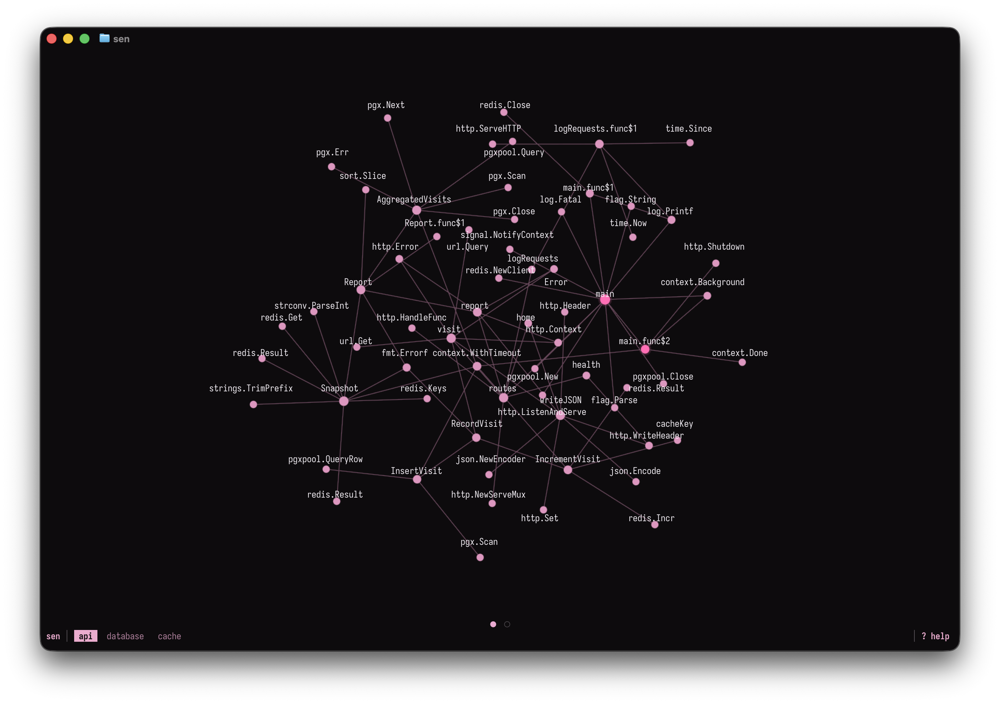
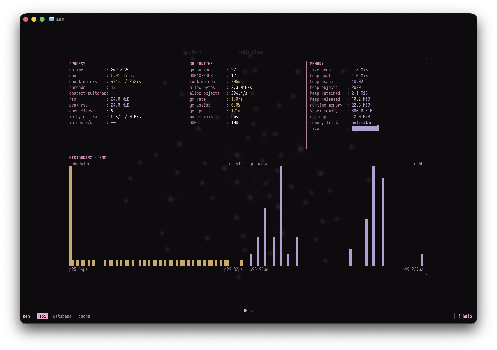

# Sen

Inspired by SenbonZakura, sen maps application code and backing services into a live TUI.
It combines source analysis with runtime telemetry so you can see where time,
memory, and activity are showing up across functions, files, calls, and dependencies.

Sen currently supports Go and Node.js applications plus Redis and PostgreSQL services.



- Static call-graph analysis
- Process and memory measurements
- CPU profiles and runtime traces
- Source-level mapping into a TUI-owned `RuntimeGraph`



## Installation

Using Nix:

```sh
# Try before installing
nix run github:briheet/sen

# Run a project in the TUI
nix run github:briheet/sen -- run ./examples/go/postgresredis

# Install
nix profile install github:briheet/sen
```

Using Go:

```sh
# Try before installing
go run github.com/briheet/sen/cmd/sen@v0.1.0

# Run a project in the TUI
go run github.com/briheet/sen/cmd/sen@v0.1.0 run ./examples/go/postgresredis

# Install
go install github.com/briheet/sen/cmd/sen@v0.1.0
```

## Quickstart

Start the example PostgreSQL and Redis services:

```sh
docker compose -f examples/go/postgresredis/compose.yaml up -d
```

Build sen from the repository root:

```sh
go build -trimpath -ldflags='-s -w' -o bin/sen cmd/sen/main.go
```

Run the example project:

```sh
./bin/sen run ./examples/go/postgresredis
```

## Use Sen with Your Service

Ready to use Sen with your own project? See the setup guides for
[Go services](docs/go.md) and [Node.js services](docs/node.md).

## License

Sen is available under the [MIT License](LICENSE).
