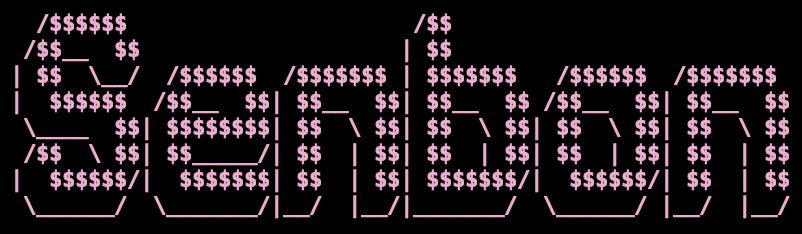

Senbon analyzes an application's source code and combines it with live runtime
data so performance costs can be displayed on files, functions, and call paths.

Senbon currently supports Go and Node.js, combining:

- Static call-graph analysis
- Process and memory measurements
- CPU profiles and runtime traces
- Source-level mapping into a TUI-owned `RuntimeGraph`

The target source is not modified. Adapters instrument each runtime and remove
their temporary artifacts on exit.

## Usage

Go 1.25.12 or newer is required to build Senbon.

```sh
go build -o bin/senbon ./cmd/senbon
./bin/senbon run node ./examples/node
```

The CLI currently runs and samples the target. The TUI is under development.

## License

Senbon is available under the [MIT License](LICENSE).
